---
## Front matter
lang: ru-RU
title: Лабораторная работа №3. Дискреционное разграничение прав в Linux. Два пользователя.
author: Захарова Софья Михайловна

## Formatting
toc: false
slide_level: 2
##theme: metropolis
mainfont: PT Serif 
romanfont: PT Serif
sansfont: PT Sans
monofont: PT Mono
header-includes: 
## - '\metroset{progressbar=frametitle,sectionpage=progressbar,numbering=fraction}'
 - '\makeatletter'
## - '\beamer@ignorenonframefalse'
 - '\makeatother'
aspectratio: 43
section-titles: true
---
# Цель работы

Получение практических навыков работы в консоли с атрибутами файлов для групп пользователей.

---
# Задание

Лабораторная работа подразумевает работу с виртуальной машиной VirtualBox, операционной системой Linux, дистрибутивом Centos и закрепление теоретических основ получения практических навыков работы в консоли с атрибутами файлов для групп пользователей.

---
# Выполнение лабораторной работы

1. Создадим учётную запись первого пользователя с именем guest и зададим пароль (рис.1).

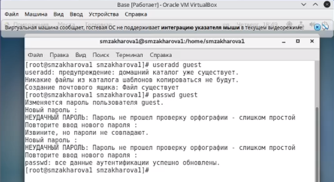{ #fig:001 width=50% }

---

2. Создадим учётную запись второго пользователя с именем guest и зададим пароль (рис.2).

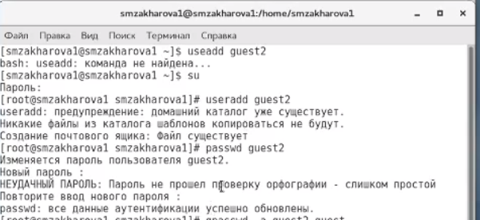{ #fig:002 width=50% }

---

3. Добавляем пользователя guest2 в группу guest (рис.3). 

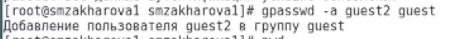{ #fig:003 width=50% }

---

4. Осуществляем вход в систему от двух пользователей на двух разных консолях: guest на первой консоли и guest2 на второй консоли, для обоих пользователей командой pwd определяем директорию, в которой находимся и сравниваем её с приглашением командной строки. Для первого (рис.4): 

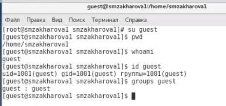{ #fig:004 width=50% }

---

5. Для второго (рис.5):

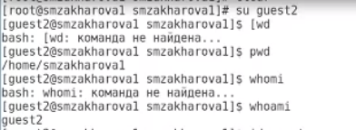{ #fig:005 width=50% }

---

6. Уточняем имя пользователя, его группу, кто входит в неё и к каким группам принадлежит он сам и определяем командами groups guest и groups guest2, в какие группы входят пользователи guest и guest2 (рис. 6).

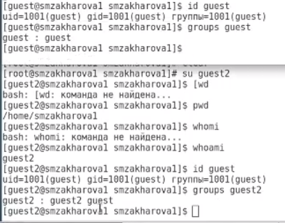{ #fig:006 width=50% }

---

7. Сравниваем выводы команд groups с выводом команд id –Gn и id –G (рис.7).

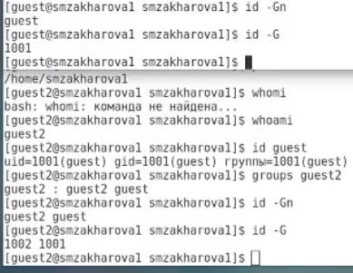{ #fig:007 width=50% }

---

8. Сравниваем полученную информацию с содержимым файла /etc/group. Просмотрим файл командой cat /etc/group (рис. 8).

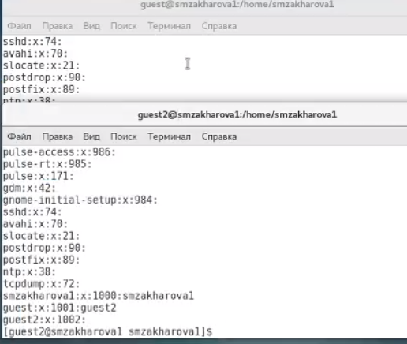{ #fig:008 width=50% }

---

9. От имени пользователя guest2 выполняем регистрацию пользователя guest2 в группе guest командой newgrp guest (рис. 9).

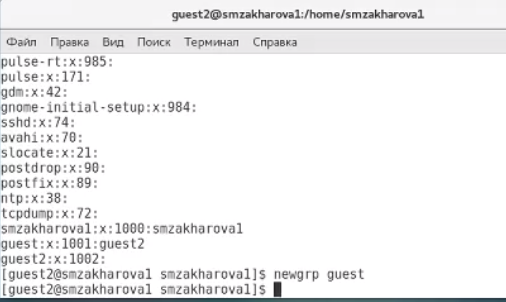{ #fig:009 width=50% }

---

10. От имени пользователя guest изменяем права директории /home/guest, разрешив все действия для пользователя группы: chmod g+rwx /home/guest и снимаем с директории /home/guest/dir1 все атрибуты командой chmod 000 dir1, а также проверяем правильность снятия атрибутов (рис. 10).

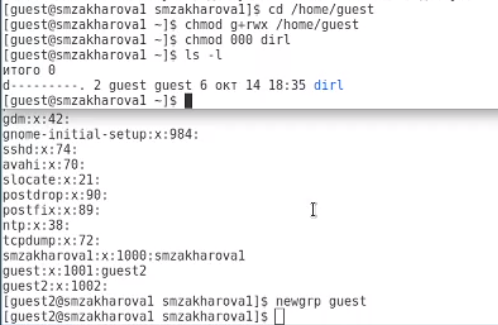{ #fig:010 width=50% }

---

11. Меняя атрибуты у директории dir1 и файла file1 от имени пользователя guest и делая проверку от пользователя guest2, заполняем таблицу 3.1, определив опытным путём, какие операции разрешены, а какие нет. Если операция разрешена, заносим в таблицу знак «+», если не разрешена, знак «-». Сравниваем таблицу 1 и таблицу из предыдущей лабораторной работы (рис.11-13).

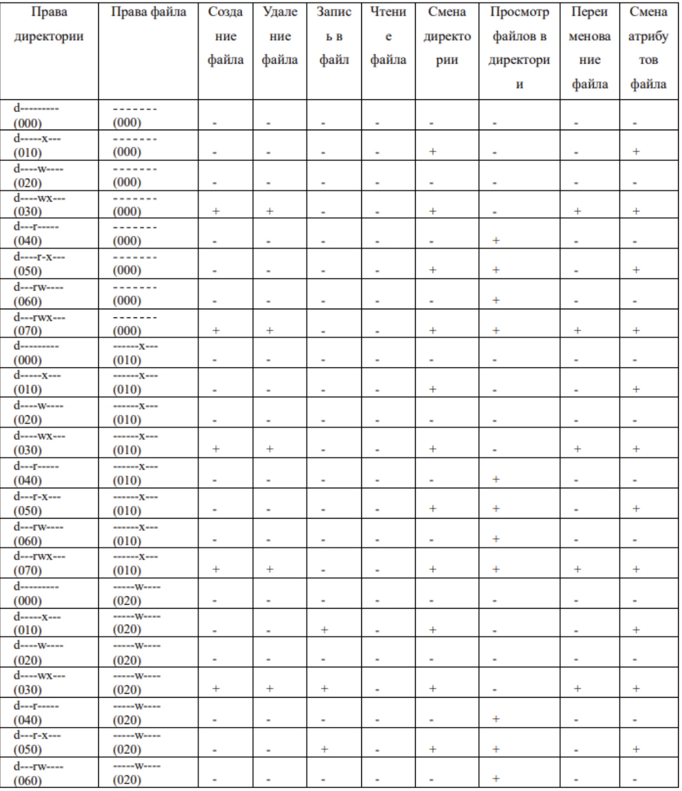{ #fig:011 width=50% }

12. 

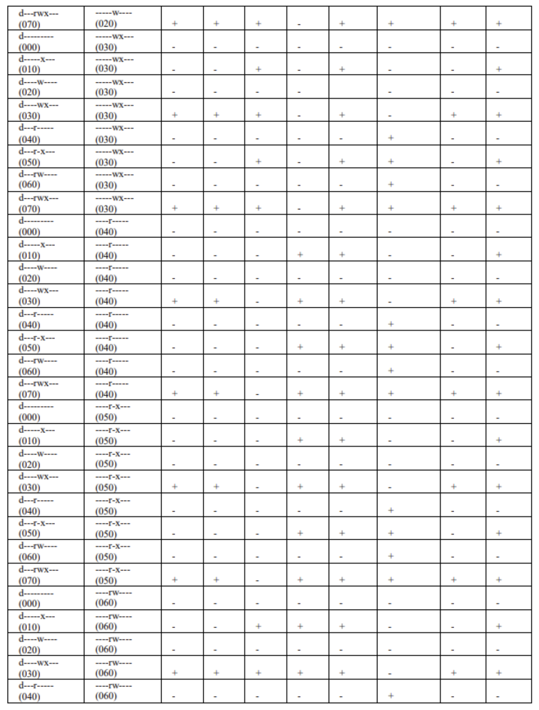{ #fig:012 width=50% }

13. 

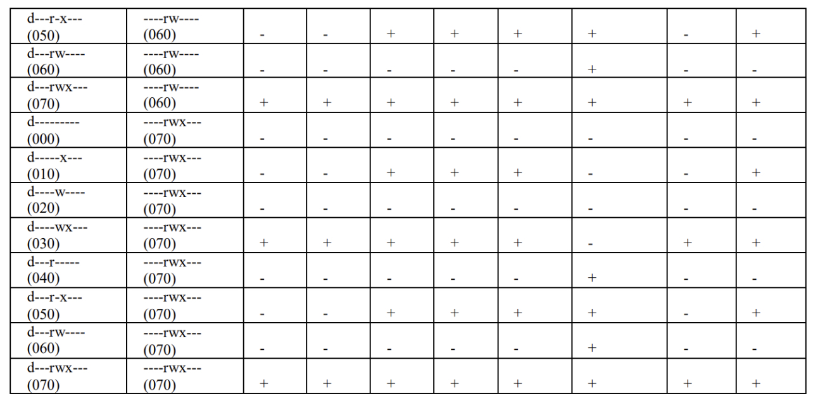{ #fig:013 width=50% }

---

14. На основании заполненной таблицы определяем те или иные минимально необходимые права для выполнения пользователем guest2 операций внутри директории dir1 и заполняем таблицу 2 (рис.14).

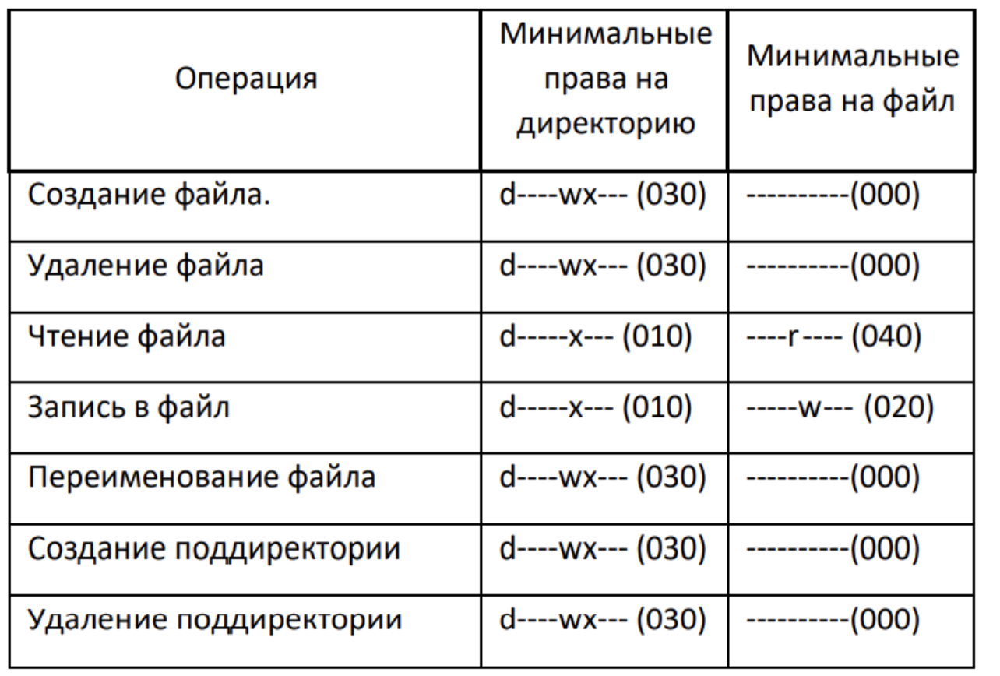{ #fig:014 width=50% }

---
# Выводы

В ходе выполнения работы мы смогли приобрести практические навыки работы в консоли с атрибутами файлов для групп пользователей.

---

## {.standout}

Спасибо за внимание!
